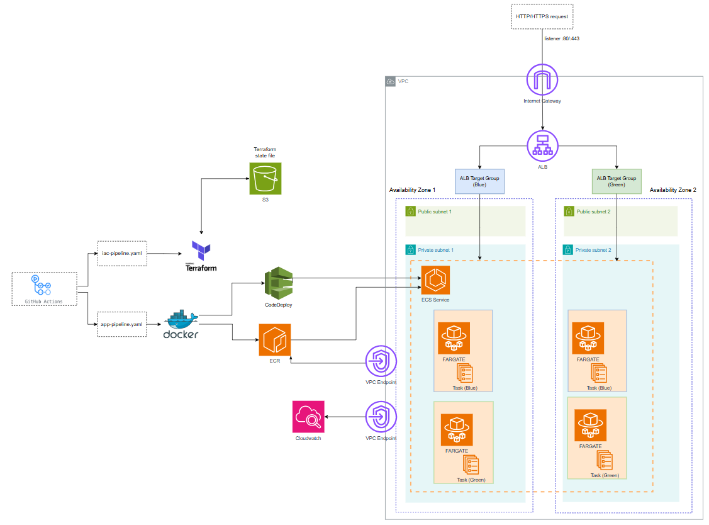

# iac-template

This project runs as a FastAPI deep learning app service on ECS Fargate behind an Application Load Balancer.

Infrastructure is managed with Terraform and is responsible for AWS resources such as networking, ECS, IAM, ECR, and the Application Load Balancer. Application builds and deployments are handled separately using GitHub Actions and immutable container images.

Stage 1 (current):

GitHub Actions forces a new ECS service deployment using the existing task definition referenced by Terraform.
The container image uses the `latest` tag.
This keeps the application pipeline separate from infrastructure, but image tags do not change, which makes rollbacks harder.

Stage 2:

GitHub Actions owns the task definition.
New versions are deployed by building and pushing a Docker image to ECR and registering a new task definition revision.
The downside is that Terraform no longer owns task configuration such as CPU and memory.

Stage 3:

Terraform is split into two stacks.
GitHub Actions runs `terraform apply` only for the workload stack that contains the ECS service and task definition.
This keeps Terraform as the source of truth while still separating application and infrastructure pipelines.


## Architecture



## Security


Current security controls:
- ECS tasks run in private subnets and are only reachable through the Application Load Balancer.
- Security groups restrict inbound traffic to the ALB and allow the ECS service only from the ALB.
- IAM follows least privilege:
  - task execution role is limited to pulling images from ECR and writing logs to CloudWatch
 
Future improvements:
- GitHub Actions to use IAM roles instead of static keys
- add HTTPS on the ALB and redirect HTTP to HTTPS
- add authentication in front of the service
- enable AWS WAF on the ALB for basic protection (rate limiting, common rules)
- store secrets in Secrets Manager
- allow only CloudFront to access the Application Load Balancer


## Application container

This repository includes a small FastAPI application packaged as a Docker container to demonstrate application delivery on ECS Fargate.

The service exposes a simple API for training and running a deep learning model (a small neural network) using FastAI. The model performs basic tabular regression and is used as a simple example workload for the infrastructure.


### Run locally

Docker and Docker Compose are required.

```bash
cd ./app
docker compose up --build
```

## Run infrastructure

Terraform is used to create the AWS infrastructure. The `infra/live/prod` directory is the environment entry point and wires together all Terraform modules.

```bash
cd infra/live/prod
terraform init
terraform apply
```

## Terraform stack split

Future plan is to split Terraform into two stacks.

core stack:
- networking
- ALB
- VPC endpoints
- shared IAM

workload stack:
- ECS service
- task definitions

In this setup Terraform will own the task definition rather than Github Actions. And GitHub Actions would run terraform apply for the workload stack only.

## Repository structure

infra/
- live/prod  
  - environment entry point (variables, providers, state)
- modules/  
  - network: VPC, subnets, routing  
  - security: security groups  
  - alb: application load balancer and listeners  
  - ecr: container registry  
  - ecs: ECS cluster, task definition, service  
  - vpc_endpoints: interface and gateway endpoints  

app/
- FastAPI application and Dockerfile

.github/workflows/
- GitHub Actions pipelines for build and deployment

